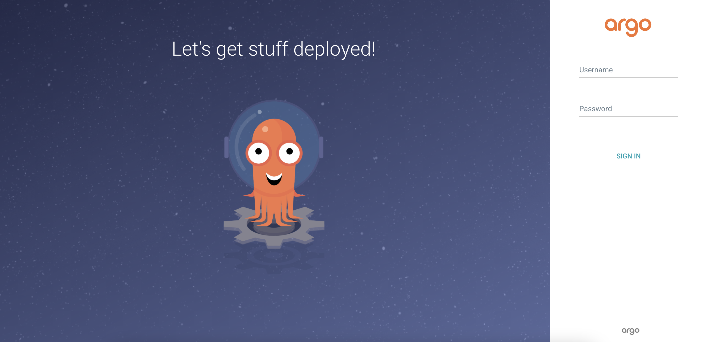

### Connecting to Argo CD
Argo CD generates a default admin user, and a random password when first deployed.

You can connect to Argo CD using this user account via the CLI or web console.

### Connecting with the CLI

To login using the CLI you’ll need to obtain the admin password and URL for the Argo CD instance:

### To get the Argo CD password execute:

argoPass=$(kubectl -n argocd get secret argocd-initial-admin-secret -o jsonpath="{.data.password}" | base64 -d)
echo $argoPass

### Get ArgoCD URL:

argoURL=$(minikube -p gitops service argocd-server -n argocd --url -p gitops | tail -n 1 | sed -e 's|http://||')
echo $argoURL

### Login to Argo CD with the argocd CLI using the URL and password:

argocd login --insecure --grpc-web $argoURL  --username admin --password $argoPass

Access the Argo CD console by logging in with the username admin and the password extracted in the previous step:

ArgoCDLogin
Once you’ve logged in, you should see the following page. This is the Argo CD Web UI.

